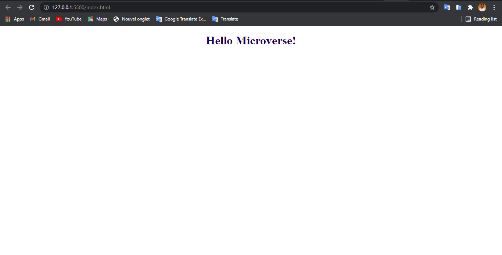

# Microverse-Project1

> Project to be familiarized with Linters and Gitflow. 

In this repo no complex coding is required, our goal here is to master all of the tools and best practices we learn about setup a linter for Html and CSS file and Git/Github.

## Built With

- Major languages: HTML/CSS
- Technologies used: Linter/Git/Github

## Live Demo

[Live Demo Link](https://rolandm99.github.io/Setup-linter/)

## Getting Started

**This is an example of how you may give instructions on setting up your project locally.**
**Modify this file to match your project, remove sections that don't apply. For example: delete the testing section if the currect project doesn't require testing.**

To get a local copy up and running follow these simple example steps.

### Prerequisites : Knowloge about basic html,css, Git and Github

1. First clone the project $ git clone https://github.com/ahzia/HTML-Signup-Form
2. Then open index.html in your browser
3. [optional] You can even fork the project

## Authors

👤 **Roland Manful Mweze**

- GitHub: [RolandM99](https://github.com/RolandM99)
- Twitter: [@Manfulmwez](https://twitter.com/ManfulMwez)
- LinkedIn: [Roland N. NWEZE](https://www.linkedin.com/in/roland-n-mweze-8b1045189/)

## 🤝 Contributing

Contributions, issues, and feature requests are welcome!

Feel free to check the [issues page](../../issues/).

## Show your support

Give a ⭐️ if you like this project!

## Acknowledgments

- Hat tip to anyone whose code was used
- Inspiration
- etc

## 📝 License

This project is [MIT](./MIT.md) licensed.
